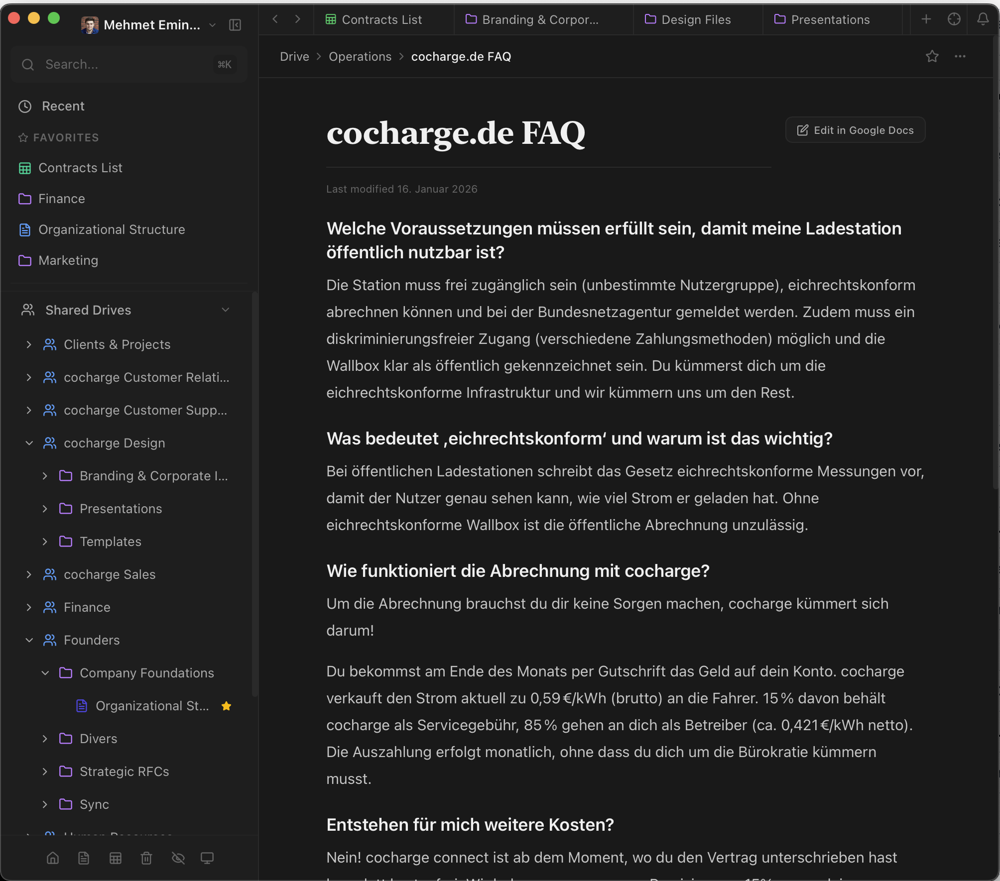
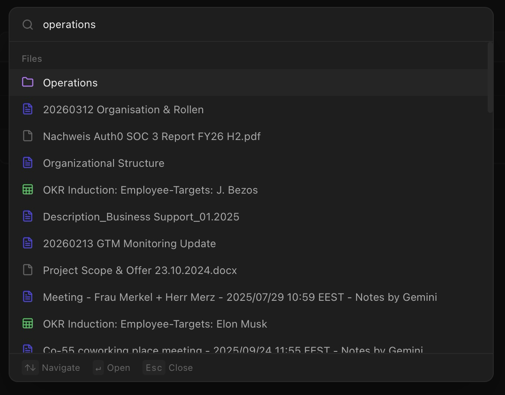

  

<h1 align="center">Doction</h1>

  <strong>The Notion feeling for your Google Drive.</strong>

  <a href="https://github.com/metok/doction/releases/latest">Download</a> &nbsp;·&nbsp;
  <a href="https://github.com/metok/doction/issues">Feedback</a> &nbsp;·&nbsp;
  <a href="CONTRIBUTING.md">Contribute</a>

---

Google Drive is powerful. But let's be honest — the UI feels like 2012. Notion looks great, but your data belongs to Notion. Fun.

Doction gives you the Notion experience on top of your own Google Drive. No migration. No vendor lock-in. Your files stay where they are. They just finally look good.

## Download

| Platform | Download |
|----------|----------|
| macOS (Apple Silicon) | [.dmg](https://github.com/metok/doction/releases/latest) |
| macOS (Intel) | [.dmg](https://github.com/metok/doction/releases/latest) |
| Windows | [.msi](https://github.com/metok/doction/releases/latest) |
| Linux | [.AppImage](https://github.com/metok/doction/releases/latest) |

Install. Sign in with Google. Done. No config, no setup, no nonsense.

## What can it do?

### Your Drive, but beautiful

Folders become pages. Google Docs render inline as clean documents. Sheets as tables. Images and PDFs right in the app. No more tab chaos.

### Smart Dashboard

Your workspace greets you. Recently opened files, favorites, and latest changes — all in one view. Jump right back in where you left off.

### Tabs

Open multiple files side by side. Browser-style tabs with back/forward navigation. Because one file at a time is so 2005.

### Cmd+K everything

Fuzzy search across your entire Drive. Find files before you've finished typing.

### Drag & drop like Notion

Reorder files with drag & drop. Your layout, your rules.

### Create Docs & Sheets

Create new Google Docs and Sheets directly from the app. Pick a folder, name it, done.

### Activity Feed

See what changed across all your drives. Real-time updates without refreshing.

### Dark mode

Obviously. What else.

### Shared Drives

Team drives right next to your personal drive. Everything in one place.

### Hide what you don't need

Right-click to hide files or entire drives from the sidebar. Your workspace, your focus.

## Open Source

Doction is MIT-licensed. The code is open. Read it, fork it, build on it — or just use it.

Built with Tauri, React, and a healthy dose of frustration with the status quo.

## Feedback?

Found a bug? Got a feature idea? Just [open an issue](https://github.com/metok/doction/issues) or hit me up on [LinkedIn](https://www.linkedin.com/in/mehmet-tok/).

Built by [Mehmet Emin Tok](https://www.linkedin.com/in/mehmet-tok/).

---

[MIT License](LICENSE)
