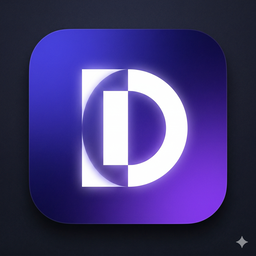
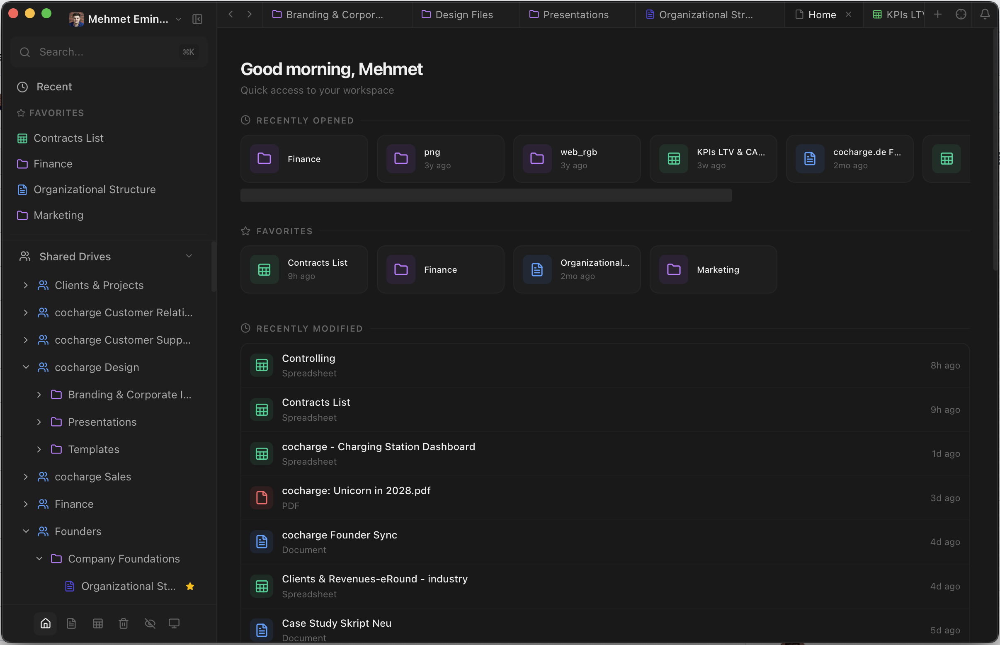

  

<h1 align="center">Doction</h1>

  <strong>Google Drive hat die Daten. Notion hat das Gefühl. Doction hat beides.</strong>

  <a href="https://github.com/metok/doction/releases/latest">Download</a> &nbsp;·&nbsp;
  <a href="https://github.com/metok/doction/issues">Feedback</a> &nbsp;·&nbsp;
  <a href="CONTRIBUTING.md">Contribute</a>

---

Google Drive ist mächtig. Aber mal ehrlich — die Oberfläche fühlt sich an wie 2012. Notion sieht geil aus, aber deine Daten gehören dann Notion. Cool.

Doction gibt dir das Notion-Feeling auf deinem eigenen Google Drive. Keine Migration. Kein Vendor Lock-in. Deine Dateien bleiben wo sie sind. Sie sehen nur endlich gut aus.

<!-- TODO: Hero screenshot (dark mode, folder view with files) -->
<!-- 

 -->

## Download

| Platform | Download |
|----------|----------|
| macOS (Apple Silicon) | [.dmg](https://github.com/metok/doction/releases/latest) |
| macOS (Intel) | [.dmg](https://github.com/metok/doction/releases/latest) |
| Windows | [.msi](https://github.com/metok/doction/releases/latest) |
| Linux | [.AppImage](https://github.com/metok/doction/releases/latest) |

Installieren. Mit Google einloggen. Fertig. Keine Config, kein Setup, kein Bullshit.

## Was kann das Ding?

### Dein Drive, aber schön

Ordner werden zu Seiten. Google Docs rendern inline als saubere Dokumente. Sheets als Tabellen. Bilder und PDFs direkt in der App. Kein Tab-Chaos mehr.

<!-- TODO: Screenshot inline doc rendering -->

### Cmd+K für alles

Fuzzy Search über dein gesamtes Drive. Dateien finden, bevor du den Namen ausgetippt hast.

<!-- TODO: Screenshot command palette -->

### Drag & Drop wie Notion

Dateien per Drag & Drop umsortieren. Dein Layout, deine Ordnung.

<!-- TODO: Screenshot drag and drop -->

### Dark Mode

Natürlich. Was sonst.

<!-- TODO: Screenshot dark/light toggle -->

### Shared Drives

Team-Drives direkt neben deinem persönlichen Drive. Alles an einem Ort.

## Open Source

Doction ist MIT-lizenziert. Der Code ist offen. Du kannst reinschauen, forken, mitbauen — oder einfach nur nutzen.

Gebaut mit Tauri, React und einer gesunden Portion Unzufriedenheit mit dem Status Quo.

## Feedback?

Bug gefunden? Feature-Idee? Einfach [Issue aufmachen](https://github.com/metok/doction/issues) oder auf [LinkedIn](https://www.linkedin.com/in/mehmet-tok/) anschreiben.

Gebaut von [Mehmet Emin Tok](https://www.linkedin.com/in/mehmet-tok/).

---

[MIT License](LICENSE)
